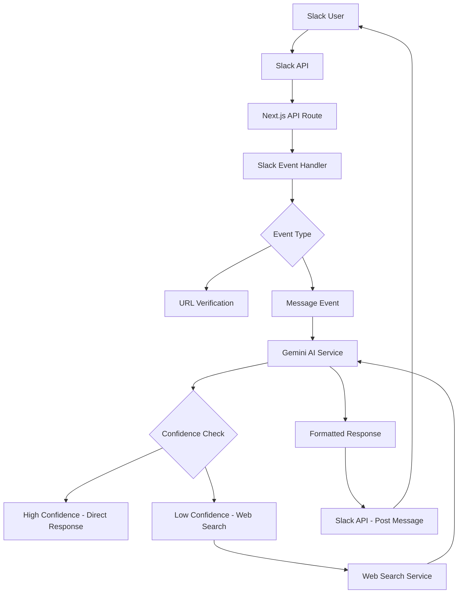

# Slack Bot with Gemini AI Integration - Architecture Summary

## Overview
This document provides a comprehensive overview of the Slack bot implementation that integrates with Google's Gemini AI and includes web search capabilities for uncertain answers.

## Architecture Diagram

## Components

### 1. Slack Event Handler
- **Location**: `src/app/api/[...route]/route.ts` (extended)
- **Endpoints**: 
  - POST `/api/v1/slack/events` - Main event handler
- **Responsibilities**:
  - Verify Slack request signatures
  - Handle URL verification challenges
  - Parse and route Slack events
  - Send responses back to Slack

### 2. Gemini AI Service
- **Dependencies**: `@google/genai`, `@ai-sdk/google`
- **Responsibilities**:
  - Initialize Gemini client
  - Generate responses to user queries
  - Assess response confidence levels
  - Format responses for Slack

### 3. Web Search Service
- **Dependencies**: Google Custom Search API
- **Responsibilities**:
  - Perform web searches for low-confidence queries
  - Process and format search results
  - Enhance prompts with search information

### 4. Environment Configuration
- **File**: `.env.local` (not committed to version control)
- **Variables**:
  - `SLACK_SIGNING_SECRET` - Slack signing secret
  - `SLACK_BOT_TOKEN` - Slack bot token
  - `GOOGLE_GENERATIVE_AI_API_KEY` - Gemini API key
  - `GOOGLE_SEARCH_API_KEY` - Google Search API key
  - `GOOGLE_SEARCH_ENGINE_ID` - Google Search Engine ID

## Implementation Flow

### 1. Request Processing
1. Slack sends an event to `/api/v1/slack/events`
2. The request signature is verified using the signing secret
3. The event payload is parsed and validated

### 2. Event Handling
1. For `url_verification` events, respond with the challenge
2. For `event_callback` events:
   - Extract message content
   - Send to Gemini AI service

### 3. Response Generation
1. Send user message to Gemini as a prompt
2. Receive and analyze Gemini's response
3. Determine confidence level:
   - High confidence: Format and send response directly
   - Low confidence: Trigger web search

### 4. Web Search Enhancement
1. Perform web search with original query
2. Process search results
3. Create enhanced prompt with search information
4. Send enhanced prompt to Gemini
5. Format and send final response

## Security Considerations

1. **Request Verification**: All Slack requests are verified using HMAC-SHA256 signatures
2. **Environment Variables**: API keys are stored in environment variables, not in code
3. **Timestamp Validation**: Requests with old timestamps are rejected to prevent replay attacks

## Error Handling

1. **Slack Verification Failures**: Return appropriate HTTP status codes
2. **API Failures**: Log errors and return fallback responses
3. **Timeouts**: Implement reasonable timeouts for external API calls
4. **Rate Limiting**: Handle rate limiting from Gemini and Google Search APIs

## Testing Plan

Refer to `slack-bot-testing-plan.md` for detailed testing scenarios and success criteria.

## Dependencies to Install

1. `@ai-sdk/openai` - Vercel AI SDK
2. `@google/genai` - Google Generative AI SDK
3. `@slack/bolt` - Slack Bolt Framework

## Next Steps

1. Install the required dependencies
2. Set up the environment variables
3. Implement the Slack event handler
4. Implement the Gemini AI service
5. Implement the web search service
6. Integrate all components in the main route handler
7. Test the implementation thoroughly